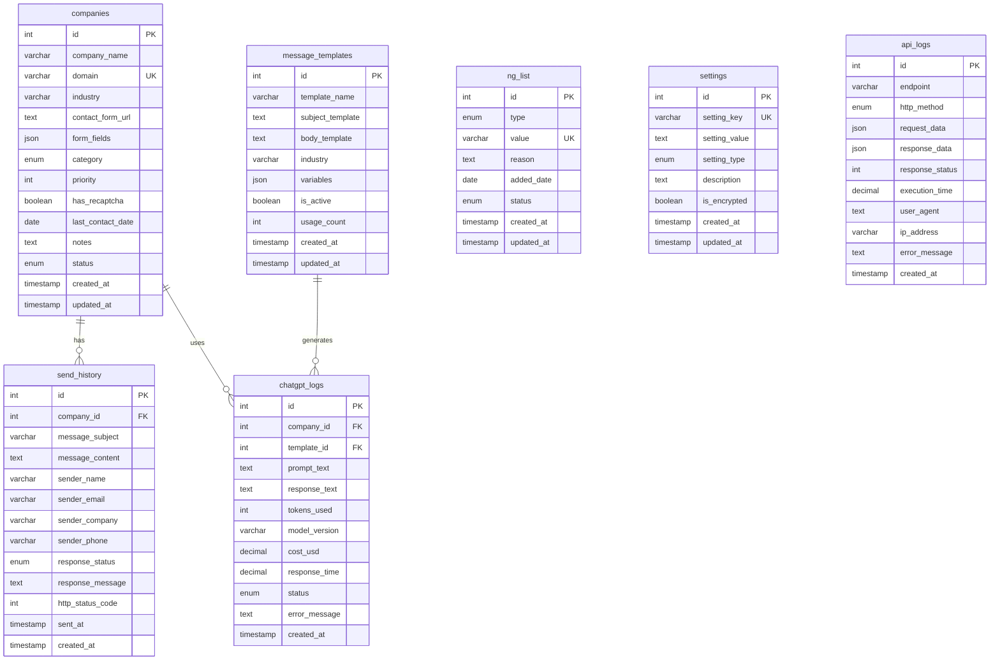

# データベース設計

## ER図

## テーブル定義

### companies（企業情報）
| カラム名 | 型 | 制約 | 説明 |
|---------|-----|------|------|
| id | INT | PK, AUTO_INCREMENT | 企業ID |
| company_name | VARCHAR(255) | NOT NULL | 企業名 |
| domain | VARCHAR(255) | NOT NULL, UNIQUE | ドメイン |
| industry | VARCHAR(100) | - | 業界 |
| contact_form_url | TEXT | - | 問い合わせフォームURL |
| form_fields | JSON | - | フォームフィールド情報 |
| category | ENUM | DEFAULT 'メイン' | カテゴリ（メイン/サブ/テスト/停止中） |
| priority | INT | DEFAULT 1 | 優先度（1-5） |
| has_recaptcha | BOOLEAN | DEFAULT FALSE | reCAPTCHA有無 |
| last_contact_date | DATE | - | 最終コンタクト日 |
| notes | TEXT | - | 備考 |
| status | ENUM | DEFAULT 'active' | ステータス（active/inactive/blocked） |
| created_at | TIMESTAMP | DEFAULT CURRENT_TIMESTAMP | 作成日時 |
| updated_at | TIMESTAMP | DEFAULT CURRENT_TIMESTAMP ON UPDATE CURRENT_TIMESTAMP | 更新日時 |

### ng_list（NGリスト）
| カラム名 | 型 | 制約 | 説明 |
|---------|-----|------|------|
| id | INT | PK, AUTO_INCREMENT | NGリストID |
| type | ENUM | NOT NULL | NGタイプ（domain/keyword/email） |
| value | VARCHAR(255) | NOT NULL | NG値 |
| reason | TEXT | - | NG理由 |
| added_date | DATE | NOT NULL | 追加日 |
| status | ENUM | DEFAULT 'active' | ステータス（active/inactive） |
| created_at | TIMESTAMP | DEFAULT CURRENT_TIMESTAMP | 作成日時 |
| updated_at | TIMESTAMP | DEFAULT CURRENT_TIMESTAMP ON UPDATE CURRENT_TIMESTAMP | 更新日時 |

### send_history（送信履歴）
| カラム名 | 型 | 制約 | 説明 |
|---------|-----|------|------|
| id | INT | PK, AUTO_INCREMENT | 送信履歴ID |
| company_id | INT | NOT NULL, FK | 企業ID |
| message_subject | VARCHAR(255) | - | 件名 |
| message_content | TEXT | - | メッセージ内容 |
| sender_name | VARCHAR(100) | - | 送信者名 |
| sender_email | VARCHAR(255) | - | 送信者メールアドレス |
| sender_company | VARCHAR(255) | - | 送信者企業名 |
| sender_phone | VARCHAR(50) | - | 送信者電話番号 |
| response_status | ENUM | DEFAULT 'pending' | 送信ステータス（pending/success/failed/blocked） |
| response_message | TEXT | - | レスポンスメッセージ |
| http_status_code | INT | - | HTTPステータスコード |
| sent_at | TIMESTAMP | DEFAULT CURRENT_TIMESTAMP | 送信日時 |
| created_at | TIMESTAMP | DEFAULT CURRENT_TIMESTAMP | 作成日時 |

### settings（システム設定）
| カラム名 | 型 | 制約 | 説明 |
|---------|-----|------|------|
| id | INT | PK, AUTO_INCREMENT | 設定ID |
| setting_key | VARCHAR(100) | NOT NULL, UNIQUE | 設定キー |
| setting_value | TEXT | - | 設定値 |
| setting_type | ENUM | DEFAULT 'string' | 設定タイプ（string/number/boolean/json） |
| description | TEXT | - | 説明 |
| is_encrypted | BOOLEAN | DEFAULT FALSE | 暗号化フラグ |
| created_at | TIMESTAMP | DEFAULT CURRENT_TIMESTAMP | 作成日時 |
| updated_at | TIMESTAMP | DEFAULT CURRENT_TIMESTAMP ON UPDATE CURRENT_TIMESTAMP | 更新日時 |

### message_templates（メッセージテンプレート）
| カラム名 | 型 | 制約 | 説明 |
|---------|-----|------|------|
| id | INT | PK, AUTO_INCREMENT | テンプレートID |
| template_name | VARCHAR(100) | NOT NULL | テンプレート名 |
| subject_template | TEXT | - | 件名テンプレート |
| body_template | TEXT | NOT NULL | 本文テンプレート |
| industry | VARCHAR(100) | - | 対象業界 |
| variables | JSON | - | 使用可能変数 |
| is_active | BOOLEAN | DEFAULT TRUE | アクティブフラグ |
| usage_count | INT | DEFAULT 0 | 使用回数 |
| created_at | TIMESTAMP | DEFAULT CURRENT_TIMESTAMP | 作成日時 |
| updated_at | TIMESTAMP | DEFAULT CURRENT_TIMESTAMP ON UPDATE CURRENT_TIMESTAMP | 更新日時 |

### api_logs（APIログ）
| カラム名 | 型 | 制約 | 説明 |
|---------|-----|------|------|
| id | INT | PK, AUTO_INCREMENT | ログID |
| endpoint | VARCHAR(255) | NOT NULL | エンドポイント |
| http_method | ENUM | NOT NULL | HTTPメソッド（GET/POST/PUT/DELETE） |
| request_data | JSON | - | リクエストデータ |
| response_data | JSON | - | レスポンスデータ |
| response_status | INT | - | レスポンスステータス |
| execution_time | DECIMAL(8,3) | - | 実行時間（秒） |
| user_agent | TEXT | - | ユーザーエージェント |
| ip_address | VARCHAR(45) | - | IPアドレス |
| error_message | TEXT | - | エラーメッセージ |
| created_at | TIMESTAMP | DEFAULT CURRENT_TIMESTAMP | 作成日時 |

### chatgpt_logs（ChatGPT使用ログ）
| カラム名 | 型 | 制約 | 説明 |
|---------|-----|------|------|
| id | INT | PK, AUTO_INCREMENT | ログID |
| company_id | INT | FK | 企業ID |
| template_id | INT | FK | テンプレートID |
| prompt_text | TEXT | NOT NULL | プロンプト |
| response_text | TEXT | - | ChatGPTレスポンス |
| tokens_used | INT | - | 使用トークン数 |
| model_version | VARCHAR(50) | - | モデルバージョン |
| cost_usd | DECIMAL(10,6) | - | コスト（USD） |
| response_time | DECIMAL(8,3) | - | レスポンス時間（秒） |
| status | ENUM | DEFAULT 'success' | ステータス（success/error/timeout） |
| error_message | TEXT | - | エラーメッセージ |
| created_at | TIMESTAMP | DEFAULT CURRENT_TIMESTAMP | 作成日時 |

## インデックス設計

### 主要インデックス
- **companies**: domain(UNIQUE), category, status, priority, last_contact_date
- **ng_list**: (type, value)(UNIQUE), type, status
- **send_history**: company_id, response_status, sent_at
- **settings**: setting_key(UNIQUE)
- **message_templates**: is_active, industry
- **api_logs**: endpoint, http_method, response_status, created_at
- **chatgpt_logs**: company_id, template_id, status, created_at

### パフォーマンス考慮事項
1. **大量データ対応**: api_logs, chatgpt_logs, send_historyは定期的なアーカイブが必要
2. **検索最適化**: 企業検索では複合インデックス（category, status, priority）を活用
3. **ログ分析**: 日別・月別の集計クエリに対応するためのパーティショニング検討

## セキュリティ対策

### 暗号化対象
- **settings.setting_value**: is_encrypted=TRUEの場合（APIキーなど）
- **個人情報**: 必要に応じて送信者情報も暗号化検討

### アクセス制御
- **外部からの直接アクセス禁止**: .htaccessで保護
- **SQLインジェクション対策**: プリペアドステートメント必須
- **ログ保護**: 機密情報のログ出力禁止

## 関連情報
- [[システム設計書#データベース]]
- [[API仕様書#データアクセス]]
- [[05-参考資料/法令関連#個人情報保護]]